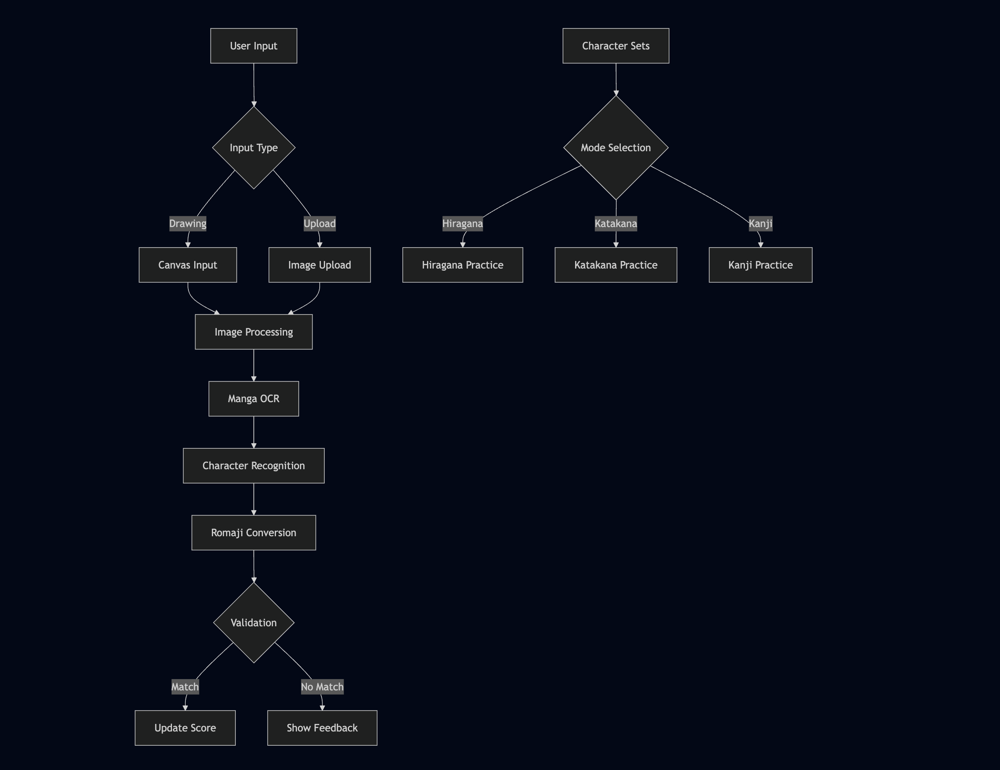

# Japanese Writing Practice App ✍️

## Purpose
The Japanese Writing Practice App is an interactive web application designed to help users learn and practice writing Japanese characters (Hiragana, Katakana, and Basic Kanji). The app provides a digital drawing canvas for practice, real-time character recognition for validation, and a knowledge testing system to track learning progress.

## Technical Details

### Drawing and Image Handling
- **Drawing Canvas**: Utilizes `streamlit-drawable-canvas` for interactive drawing functionality
  - Provides customizable stroke width and color
  - Supports freehand drawing mode
  - Canvas dimensions: 400x400 pixels
  - RGBA format with transparent background

- **Image Upload**:
  - Supports PNG, JPG, JPEG formats
  - Automatically resizes uploaded images to fit 400x400 dimensions
  - Maintains aspect ratio using Lanczos resampling

### Character Sets
The app includes four practice modes:
1. **Hiragana**: Basic Japanese syllabary (あ, い, う, etc.)
2. **Katakana**: Syllabary used for foreign words (ア, イ, ウ, etc.)
3. **Basic Kanji**: Fundamental Chinese characters (一, 二, 三, etc.)
4. **Random Selection**: Dynamic words fetched from backend API

Each character is stored with:
- The actual character (char)
- Its romanized reading (romaji)
- Additional context for Kanji (meanings in parentheses)

### Backend Integration
The Random Selection mode connects to a FastAPI backend:
- Fetches Japanese words from `/api/words` endpoint
- Caches words in session state for efficient access
- Provides refresh functionality to get new words
- Gracefully falls back to basic characters if backend is unavailable

### Character Recognition System
The app uses a sophisticated OCR pipeline for character validation:

1. **Image Processing**:
   - Converts canvas RGBA data to RGB format
   - Applies white background for better OCR
   - Preserves stroke data using alpha channel masking

2. **OCR Implementation**:
   - Uses `manga-ocr` for Japanese character recognition
   - Converts detected characters to romaji using `pykakasi`
   - Provides detailed OCR feedback including:
     - Detected character
     - Romaji conversion
     - Match status
     - Accuracy metrics

## Setup and Running Instructions

### Prerequisites
- Python 3.13.1 or higher
- UV package manager
- FastAPI backend running on `localhost:8000` (for random selection mode)

### Installation Steps

1. **Create and activate UV virtual environment**:
   ```bash
   uv venv
   source .venv/bin/activate  # For Unix/MacOS
   # or
   .venv\Scripts\activate  # For Windows
   ```

2. **Install dependencies**:
   ```bash
   uv pip install -r requirements.txt
   ```

3. **Start the backend** (required for random selection mode):
   ```bash
   # In a separate terminal
   cd backend-FastApi
   uvicorn src.main:app --reload
   ```

4. **Run the application**:
   ```bash
   streamlit run src/app.py
   ```

The app will open in your default web browser at `http://localhost:8501`

## Application Flow



The flow chart above illustrates the complete application workflow:
1. **Input Handling**: Users can either draw characters or upload images
2. **Processing Pipeline**: Both inputs go through image processing and OCR
3. **Character Sets**: Separate paths for Hiragana, Katakana, Kanji, and Random Selection
4. **Validation**: Matches are scored, and feedback is provided for non-matches

## Features
- Interactive drawing canvas with customizable settings
- Multiple character set support (Hiragana, Katakana, Kanji)
- Random Selection mode with backend API integration
- Real-time character recognition and validation
- Progress tracking with accuracy metrics
- Detailed OCR feedback for learning
- Image upload capability for offline practice
- Word caching for efficient performance

## Technical Requirements
- streamlit>=1.32.0
- streamlit-drawable-canvas>=0.9.3
- manga-ocr
- pykakasi>=2.2.1
- Pillow>=11.1.0
- numpy>=2.2.4
- python-magic>=0.4.27
- requests>=2.31.0  # For backend API integration 